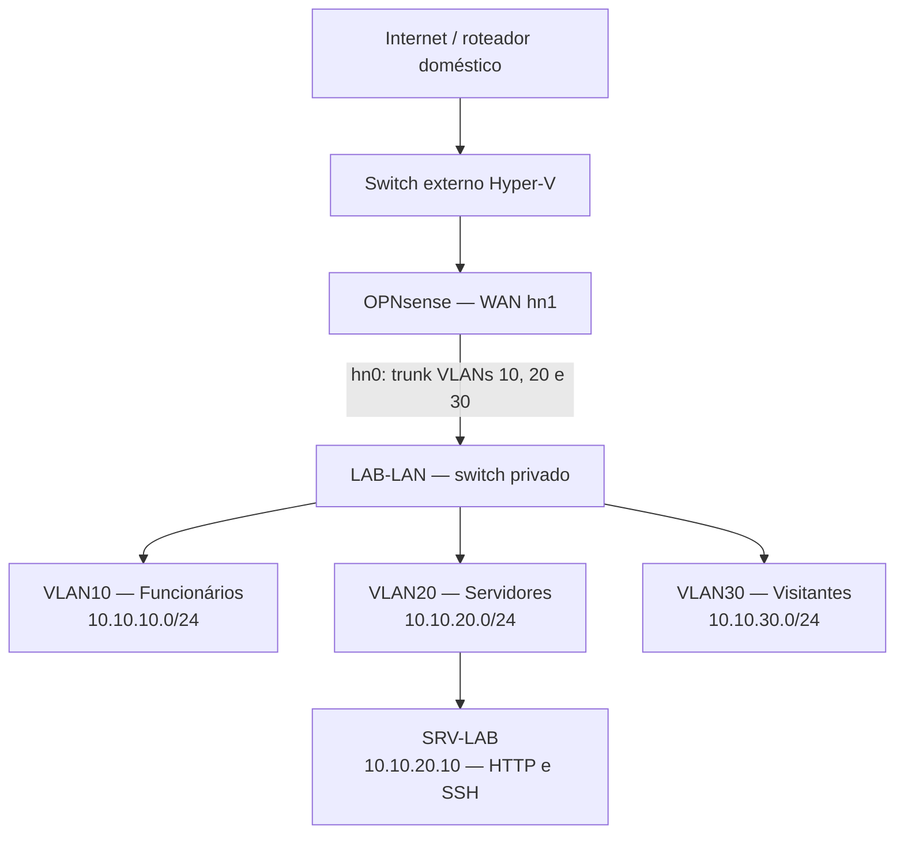
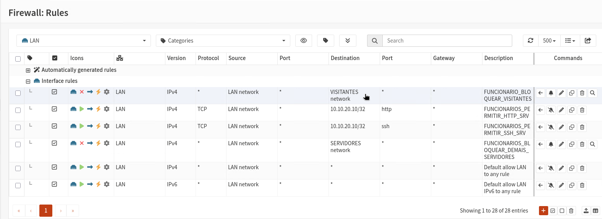
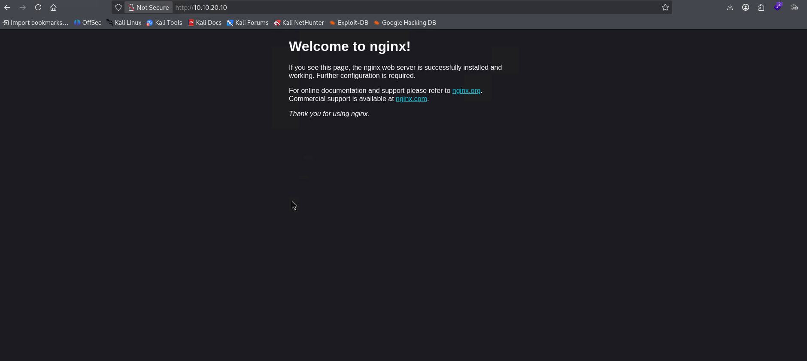
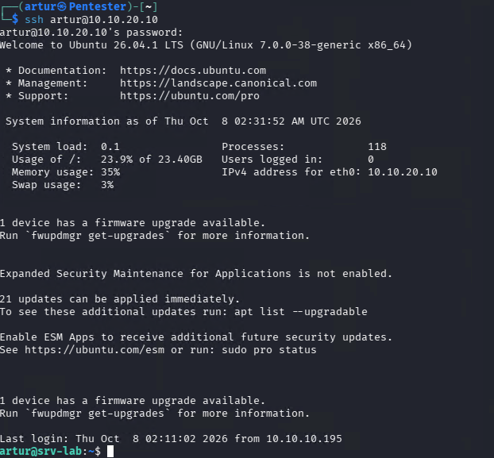
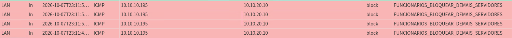
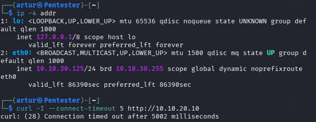

# Enterprise Network Lab

Laboratório de redes com segmentação por VLANs, DHCP, DNS, acesso à internet e controle de tráfego entre redes, implementado em Hyper-V com OPNsense.

**Autor:** Artur de Novazzi Maia  
**Status:** primeira etapa implementada e validada — segmentação e controle de acesso IPv4.

## Objetivo

Simular uma rede empresarial com funcionários, servidores e visitantes. Demonstrar configuração de infraestrutura, aplicação de regras de firewall e diagnóstico por testes e logs.

## Ambiente

| Componente | Função |
|---|---|
| Dell PowerEdge R430 / Windows Server 2025 | Host de virtualização |
| Hyper-V | Máquinas virtuais e switches virtuais |
| FW-OPNsense | Firewall, roteamento, NAT, DHCP e DNS |
| Pentester / Kali Linux | Cliente de testes, alternado entre as VLANs |
| SRV-LAB / Ubuntu Server | Servidor com Nginx e OpenSSH |

O switch privado `LAB-LAN` transporta as redes do laboratório. A WAN do firewall utiliza um switch externo conectado à rede doméstica. As redes do laboratório usam o OPNsense como gateway.

## Topologia



A VM Kali foi usada como cliente em cada VLAN, uma por vez. O diagrama representa as redes lógicas, não três clientes simultâneos.

## Endereçamento

| VLAN | Interface OPNsense | Rede | Gateway | Pool DHCP |
|---|---|---|---|---|
| 10 | LAN | 10.10.10.0/24 | 10.10.10.1 | 10.10.10.41–10.10.10.245 |
| 20 | SERVIDORES | 10.10.20.0/24 | 10.10.20.1 | 10.10.20.100–10.10.20.200 |
| 30 | VISITANTES | 10.10.30.0/24 | 10.10.30.1 | 10.10.30.100–10.10.30.200 |

O servidor `srv-lab` recebe **10.10.20.10 por reserva DHCP**, fora do pool dinâmico. O Ubuntu permanece configurado como cliente DHCP.

## Serviços e configuração

- Dnsmasq fornece DHCP às três interfaces.
- Unbound atende consultas DNS na porta 53; Dnsmasq utiliza a porta 53053.
- O firewall fornece roteamento entre as VLANs e NAT para acesso à internet.
- SRV-LAB oferece HTTP com Nginx na porta TCP 80 e SSH na porta TCP 22.
- A interface interna do firewall usa trunk no Hyper-V, com VLANs permitidas `10,20,30` e VLAN nativa `0`.
- A interface da SRV-LAB usa access VLAN20. A interface do Kali é alterada para a VLAN do teste.

## Política de firewall

As regras foram configuradas com Quick e avaliadas na ordem apresentada. As permissões específicas precedem os bloqueios. Respostas de conexões permitidas são tratadas pelo controle de estado do firewall.

### LAN / VLAN10 — ordem das regras

| Ordem | Ação | Origem | Destino | Protocolo / porta |
|---|---|---|---|---|
| 1 | Bloquear | LAN net | VISITANTES net | IPv4 / qualquer |
| 2 | Permitir | LAN net | 10.10.20.10/32 | TCP 80 |
| 3 | Permitir | LAN net | 10.10.20.10/32 | TCP 22 |
| 4 | Bloquear e registrar | LAN net | SERVIDORES net | IPv4 / qualquer |
| 5 | Permitir | LAN net | Qualquer | IPv4 / qualquer |
| 6 | Permitir — regra padrão mantida | LAN net | Qualquer | IPv6 / qualquer |

### SERVIDORES / VLAN20 e VISITANTES / VLAN30

Cada interface possui a seguinte sequência:

| Ordem | Ação | Origem | Destino | Protocolo / porta |
|---|---|---|---|---|
| 1 | Permitir | Rede da interface | Endereço da própria interface | TCP/UDP 53 |
| 2 | Bloquear e registrar | Rede da interface | REDES_PRIVADAS | IPv4 / qualquer |
| 3 | Permitir | Rede da interface | Qualquer | IPv4 / qualquer |

O alias `REDES_PRIVADAS` contém `10.0.0.0/8`, `172.16.0.0/12` e `192.168.0.0/16`. Como o bloqueio vem antes da permissão geral, conexões novas para essas redes são bloqueadas, salvo a exceção DNS acima.

## Validação realizada

| Teste | Resultado observado |
|---|---|
| DHCP nas VLANs 10, 20 e 30 | Endereços recebidos nas respectivas sub-redes |
| Reserva DHCP da SRV-LAB após reinício | 10.10.20.10 recebido |
| DNS e internet nas três VLANs | Funcionaram nos testes realizados |
| VLAN10 → SRV-LAB TCP 80 | Página Nginx abriu; curl retornou resposta HTTP |
| VLAN10 → SRV-LAB TCP 22 após restrição | Nova conexão SSH autenticada normalmente |
| VLAN10 → SRV-LAB ICMP após restrição | Sem respostas; bloqueio confirmado no log |
| SRV-LAB → Kali na VLAN10 ICMP | Sem respostas |
| VLAN30 → SRV-LAB TCP 22 | Timeout, testado antes da reserva DHCP |
| VLAN30 → SRV-LAB TCP 80 em 10.10.20.10 | Timeout |
| VLAN10 → endereço da interface VLAN30 ICMP | Sem respostas |
| VLAN20 ↔ endereços das outras interfaces internas | Bloqueios observados nos testes de isolamento |
| VLAN30 → GUI do firewall na própria interface | Timeout |
| DNS e HTTPS externo na VLAN10 após novas regras | Funcionaram |

O Live View registrou pacotes ICMP de **10.10.10.195 para 10.10.20.10** com ação `block`, associados à regra `FUNCIONARIOS_BLOQUEAR_DEMAIS_SERVIDORES`.

### Comandos usados

No Kali na VLAN10:

```bash
ip -4 addr
ip route
nslookup example.com
curl -I --connect-timeout 10 https://example.com
curl -I --connect-timeout 5 http://10.10.20.10
ssh -o ConnectTimeout=5 artur@10.10.20.10
ping -c 4 -W 2 10.10.20.10
```

No Kali na VLAN30, após receber um endereço 10.10.30.x:

```bash
curl -I --connect-timeout 5 http://10.10.20.10
```

Renovação da conexão do Kali após mudar a VLAN no Hyper-V:

```bash
sudo nmcli device disconnect eth0
sudo nmcli device connect eth0
ip -4 addr
```

No Ubuntu, instalação e verificação do servidor web:

```bash
sudo apt update
sudo apt install nginx -y
systemctl is-active nginx
```

## Backups

Backups XML foram exportados em marcos da configuração, incluindo o estado final das regras validadas. O backup completo deve ser guardado de forma privada: ele pode conter credenciais, chaves e informações do ambiente. Para o repositório público, usar documentação e capturas revisadas, ou uma configuração sanitizada.

## Escopo e próximos passos

O laboratório valida políticas **IPv4**. IPv6 não foi configurado nem validado; a regra padrão IPv6 da LAN permanece presente. Os testes demonstram os fluxos listados, não uma auditoria completa de todas as portas.

A VLAN10 ainda possui uma permissão geral para destinos fora das redes de servidores e visitantes bloqueadas. O acesso SSH ao servidor é permitido à VLAN10 inteira, como escolha desta etapa do laboratório.

Evoluções planejadas, ainda não implementadas:

- VPN para acesso remoto ao laboratório.
- Restringir administração a um cliente ou uma rede de gestão.
- Ampliar a matriz de testes e registrar capturas de tráfego com Wireshark.
- Validar resolução do nome interno do servidor.

## Aprendizados

- Diferenciar access e trunk na configuração de VLANs do Hyper-V.
- Relacionar VLAN, interface, sub-rede, gateway e escopo DHCP.
- Criar reserva DHCP mantendo o servidor como cliente DHCP.
- Aplicar exceções de serviço antes de bloqueios de rede.
- Distinguir conexões iniciadas de respostas a conexões existentes.
- Confirmar decisões do firewall por logs, além de testes de conectividade.

## Evidências dos testes

### Regras da VLAN10


### HTTP permitido para funcionários


### SSH permitido para funcionários


### ICMP bloqueado pelo firewall


### HTTP bloqueado para visitantes

